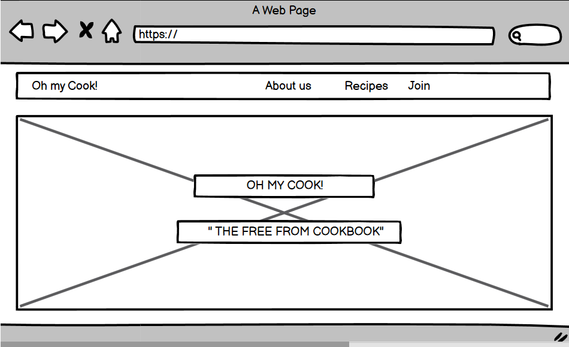
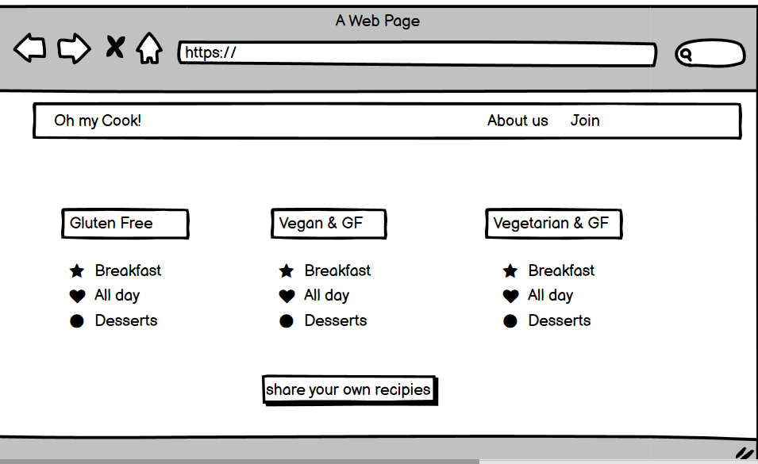
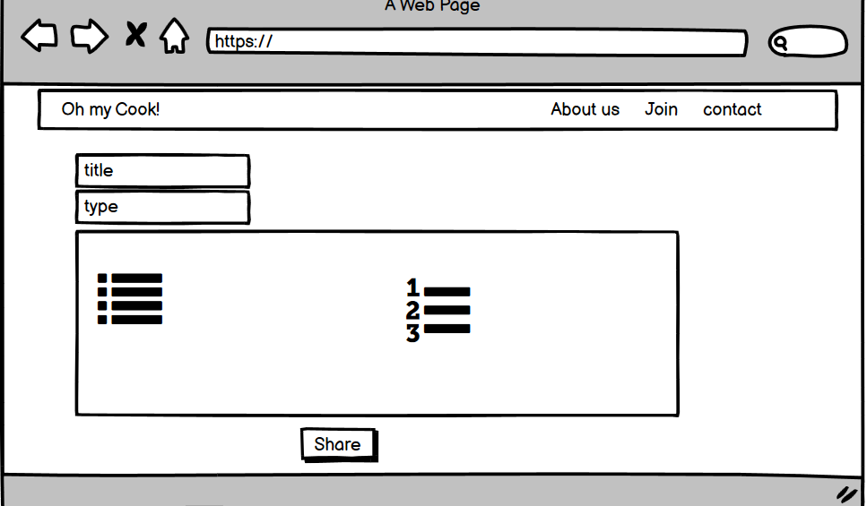
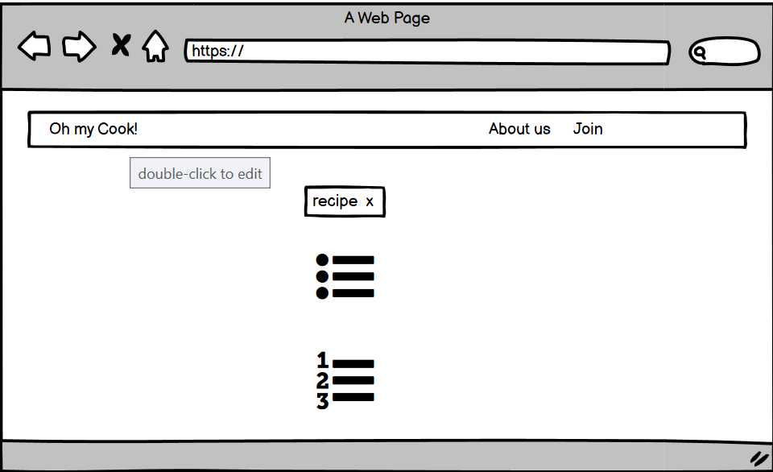
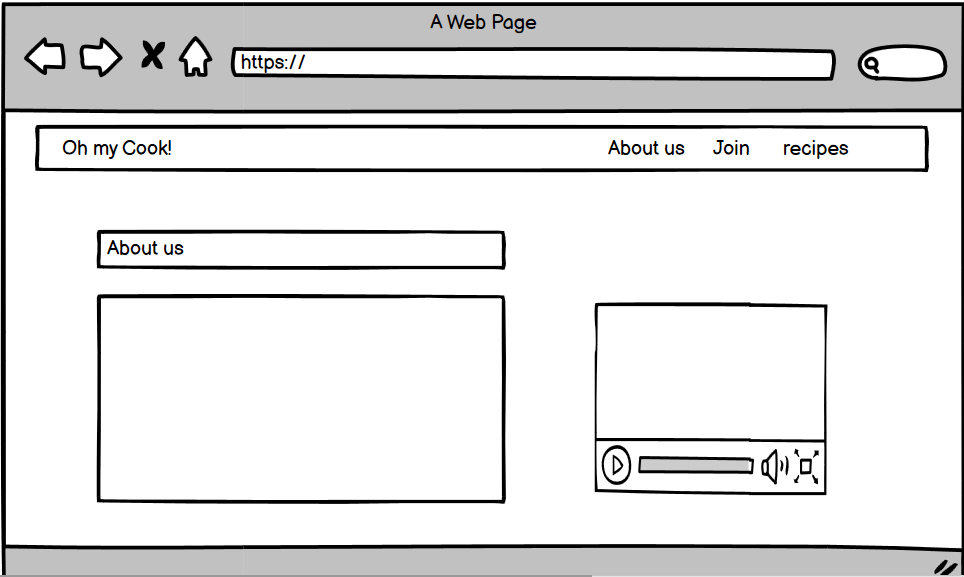
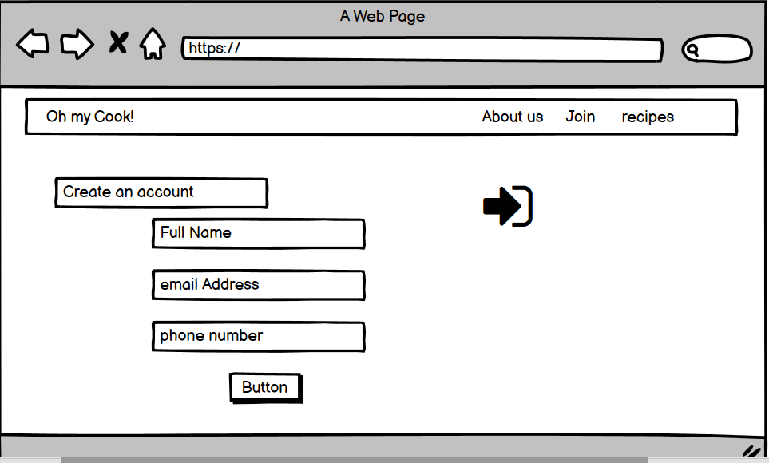

# OH MY COOK! #
## Online Cookbook ##

 
## UX ##

Project Goals:
 * Create an interactive , attractive and responsive online cookbook which offers recipes for Thermomix.
 * Signing up on the website is not requiered to access his content, however if registered you can take part of the site growth,
 as well as having access to features that external users will not have. (CRUD)
 
### Design Process ###

Create an online cookbook interactive between the users of the community and others, promoting how Thermomix helps
on a day to day basis and makes the process much easier.
To sketch the frontend part of the project I have used Blasamiq wireframes: 

   
    
     
   
   
    
   
## General Features ##

The website counts with four main pages visible for all users as Recipes or Home Page, Recipe_description which linkable from any recipe and 
will display the full info about each recipe of them, separately. The access path for the full recipe is clicking on the GO button on the colapsible
card which is a index of all recipes.
The Home or Recipes page also adverts and provides information about Thermomix, I do this choosing a very visual approach,
inserting a Carousel from Materialize.
Log in page with a link as well for Sign In and the opposite in case any user mistakes,
and once we are In, you are welcomed by a personalised profile page which has also the search for recipes  feauture.
The Sig In page directs you to the Registration Page which inputs the user details into the MongoDB database.
At last, we have the log out page which directs you to the Log In page back. 

## Registered User's Features ##
All registered users have access to the CRUD functionality:

1. C - Create: Allowed to submitt their own recipes to share with the community of users.
2. R - Read: Full access to all recipes and info about Thermomix.
3. U - Uptade: Update or change only the recipies that have been submitted under their user_id.
4. D - Delete: Delete only the recipies that have been submitted under their user_id.

Technologies Used:
 1. HTML5 : Used to create the form and the content of the web site.
 2.	CSS3 : Used to style the HTML
 3. Materialize Frameworks: Used some components, Header and card layout. 
    Also used the grid system to make the website responsive for all size devices.
 4. JavaScript: For interactivity.
 5. JQuery : The project uses JQuery to simplify DOM manipulation.
 4. Gitpod and Github : to write , test and deploy my code. 
 5. Heroku : to Deploy my project and store sensible data variables.
 6. Python3, Flask and Json
 7. Installed few liabraries :
   **PyMongo
   **Flask
   **bson 
   **werkzeug.security
    
Features to implement :

I wanted to use and add the datetime library from Python
to add exact times for user inputs into the db.

## Testing ##

I have Validated the code using: 
 * HTML   [HTML-Validator](https://validator.w3.org/#validate_by_input) - No errors found.
 * CSS    [CSS-Validator](https://jigsaw.w3.org/css-validator/#validate_by_input) - No errors found.
 * JS     [JS -Validator](https://jshint.com/) - No errors found.
 * Python [Python-Validator](http://pep8online.com/checkresult) - No errors found.

Tested the website in different browsers:    
* Chrome
* Edge
* Mozilla Firefox 
* Safary
    
I have also used the Inspect tool from Google Chrome to testt the responsiveness of the website in different size devices and 
manually tested in iPhone 6, 7 Plus, 8, xs, 12 pro, MacBook Pro 15", Asus VivoBook 14.5", HP Envy 21" , Ipad 3 and Ipad Pro 5.

* Navbar from medium and small devices converts into a dropdown menu. 
* The card containers from Materialize that have been used to organize the layout of the sign in and log in;
  from medium to small  screen sizes, the number of columns used per card is larger in a way it only shows one card at
  a time. Same with the input forms for editing and uploading recipes, and carousel and collapsible for the Home or Recipes page.

## Deployment ## 

This project was entirely built in Gitpod and deployed in Heroku and GitHub. 

Deployment steps:

1. Log in into my GitHub. 
2. Go to my repositories.
3. choose the repository called 3rdMilestoneProject.
4. Settings.
5. Select Master branch.
6. Validate selection.
7. The ulr of the website is displayed.

You can see the website [GitHub](https://SaraSanchezz.github.io/3rdMilestoneProject/)
                        [Heroku](https://oh-my-cook.herokuapp.com/)

Steps to run the code locally:

1. Open GitHub.
2. Select desired repository.
3. Click on clone or download.
4. Start your IDE.
5. Open the terminal.
6. Type git clone followed by the code of the repository at the terminal.

## Credits ## 

### Content ###
- The content of the page is been written by me and at the projects page is been copied from the projects structure and requirements, from the module materials.
- There are some parts of the code taken from Bootstrap componenents and after have been adjusted and modified it 
 to my web needs as for example:
    - [Navbar](https://getbootstrap.com/docs/4.5/components/navbar/)
    - [Collapsible](https://getbootstrap.com/docs/4.5/components/card/#header-and-footer)
    - [Card-structure](https://getbootstrap.com/docs/4.5/components/card/)

### Media ### 
- The Hero image from the Website is been taken from [Unsplash](https://unsplash.com/)
- The Thermomix images are been taken from the internet, as there is not good pictures on free libraries, 
that is one of the reasons I have linked them on the project through the external link.
-[Image 1](https://stackoverflow.com/)
-[Image 2](https://stackoverflow.com/)
-[Image 3](https://stackoverflow.com/)
-[Image 4 ](https://stackoverflow.com/)

### Acknowledgements ### 

- [W3Schools.com](https://www.w3schools.com/).
- [MDB](https://mdbootstrap.com/).
- [Thermomix.co.uk](https://www.vorwerk.co.uk/shop/thermomix/thermomix-tm6/p/62149)
- [Cookidoo](https://cookidoo.co.uk/foundation/en-GB)
- [Materialize](https://materializecss.com/about.html)
- [Stackoverflow](https://stackoverflow.com/).
- Slack Community. 
- All the tutors who had assisted me during the process, the were all helpful and extremelly kind.
